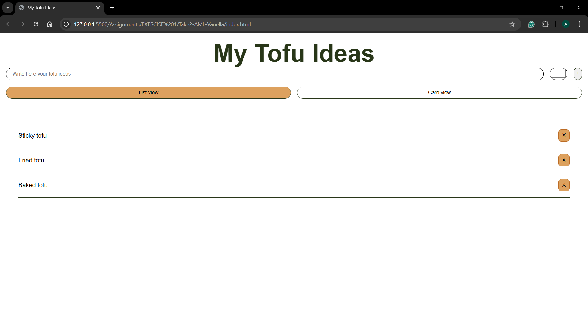
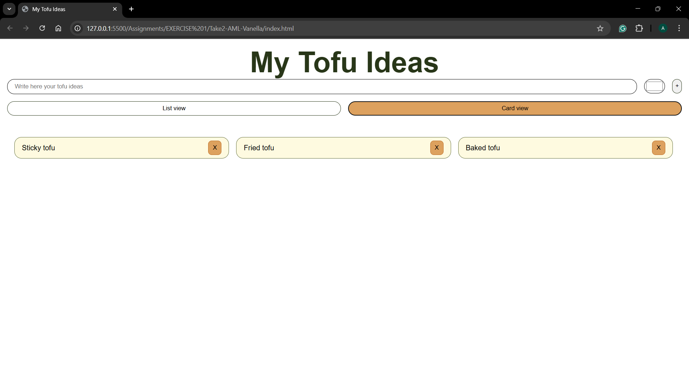

# Assignement 1 - My tofu ideas

## Brief 

 Starting from the concept of a pinboard, implement a web page that:

- is responsive (properly layout for smartphone, tablet, and desktop)
- allows the user to add and remove elements
- allows the user to coustomize elements (i.e. colors, size)
- allows the switch between two views (at least)

 ## 2 screenshots of the final file
 List view option
 

 Card view option, 3 columns for wide screen view
 

## Project description

This web application is a simple yet functional list designed for organizing tofu recipe ideas (unfortunately, I didn't feel confident enough to make it an actual recipe repository).

It is possible to add new items through a text input field and customize each entry with a unique background color using a color picker.
The option of removeing items individually was the hardest to accomplish.

The interface offers two viewing modes: a list view, and a card view that displays items as blocks. 

This mini project is supposed to show some core programming concepts, like "dynamic" element creation, and responsive design through media queries. 
As my first coding project ever, I hope it does.

## Fuctions list

#### document.getElementById()
- Arguments: id 
- Description: Selects an HTML element by its ID
- Results: The HTML element with that ID

#### addEventListener()
- Arguments: event, callback
- Description: Listens for an event (like "click") and runs a function when it happens
- Results: I can verify in the console if the function is properly working

#### classList.remove()
- Arguments: className
- Description: Removes a CSS class from an element
- Results: I can remove every item of the ul

#### classList.add()
- Arguments: className
- Description: Adds a CSS class to an element
- Results: I can add items in the ul

#### document.createElement()
- Arguments: tagName
- Description: Creates a new HTML element (like "li", "p", "button")
- Results: A new element

#### appendChild()
- Arguments: element (HTML element)
- Description: Adds a child element inside a parent element
- Results: The child element that was added

## Personal considerations about the first assignement
- Coding is a language, it is not just about "grammar" it needs a lot of practice too (and I still need a lot of that)!
- AI is not (yet) the solution. It may be (very) useful and helpful but can't actually do the job for me
- Coding looks, feels and tastes a bit like an alien language, but I think I might get to like it :)