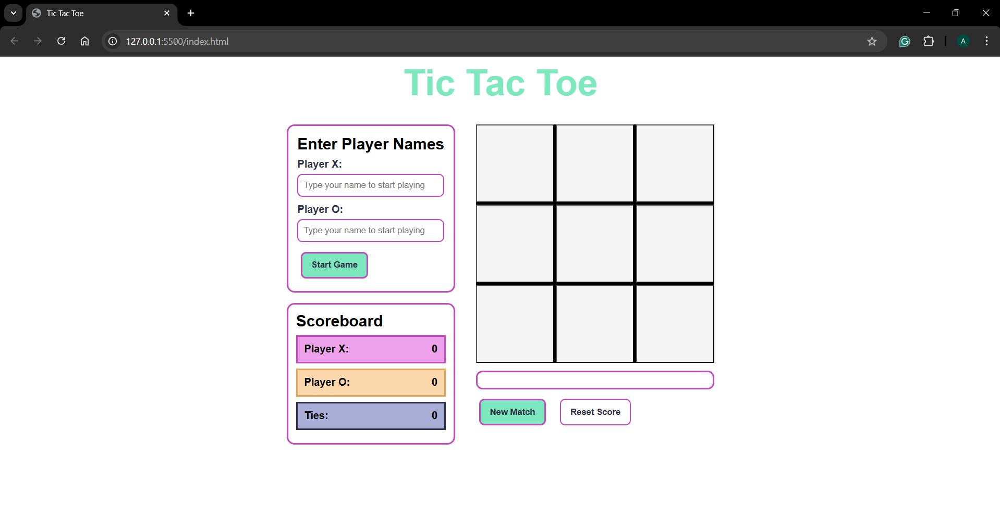
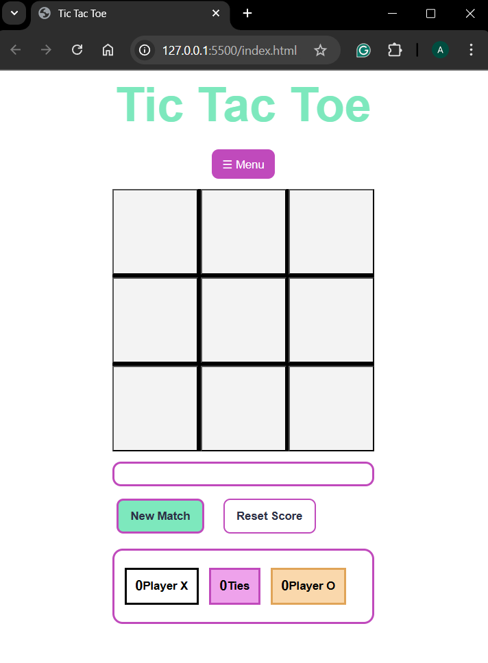

## ASSIGNMENT 2 - create a game
## BRIEF

Choose a “mini-game” to rebuild with HTML, CSS and JavaScript. The requirements are:

- The webpage should be responsive
- Choose an avatar at the beginning of the game
- Keep track of the score of the player
- Use the keyboard to control the game (indicate what are the controls in the page). You can also use buttons (mouse), but also keyboard.
- Use some multimedia files (audio, video, …)
- Implement an “automatic restart” in the game (that is not done via the refresh of the page)

# TIC TAC TOE
final result, desktop view

final result, mobile view

## DESCRIPTION OF THE GAME AND OF THE CODE BEHIND IT
This is an interactive Tic Tac Toe game that allows two players to compete against each other on a 3x3 grid, taking turns placing X's and O's until one player wins by getting three in a row (horizontally, vertically, or diagonally) or the game ends in a draw.
Each player must costumise their names in order to start the game.
The score is tracked across multiple rounds and some sound effects are included at some user interactions (clicks, errors, wins, draws).
The media queries are included, so the design adapts to desktop and mobile screens. The mobile screen includes a menu button.
The games also includes some visual feedback for the game states(turn, win, draw, error).

## STEP BY STEP
#### FLOW-CHART

##### User Actions Flow:
- Setup Phase: Enter names → Start game
- Gameplay Phase: Click cell → Check validity → Update board → Check result
- End Phase: Display result → Update score → Option to restart
- Reset Option: Available at any time to start new match or reset all scores

## LIST OF FUNCTIONS
In this section I'll be displaying:
- General role of the Javascript
- Name of the function
- What parameters does it expect (if any)
- Expression logic: describe what it does
- Return values: what values it return (if any)

#### General role in the project
The JavaScript file handles all the game logic, user interactions, and dynamic updates to the page.

##### Game State Management: 
Tracks the current board state, active player, and game status

##### Player Management: 
Stores and displays custom player names

##### Event Handling: 
Responds to user clicks on cells, buttons, and menu interactions

##### Game Logic: 
Determines winners, draws, and valid moves

##### DOM Manipulation: 
Updates the visual interface based on game state

##### Audio Control: 
Plays appropriate sound effects for different actions

##### Score Tracking: 
Maintains and updates scores across multiple rounds

##### Responsive Behavior: 
Manages different UI elements for desktop and mobile views

#### JAVASCRIPT FUNCTIONS - DETAILED LIST

##### 1. updateStatusStyle(type)
- Purpose: Updates the visual style of the game status message
- Parameters: type (string) - CSS class to apply ("status-turn", "status-win", "status-draw", "status-error")
- How it works: Removes all status classes and adds the new one
- Used when: Game state changes (turn, win, draw, error)

##### 2. initGame()
- Purpose: Initializes or resets the game to starting conditions
- Parameters: None
- What it does:
Resets the board array to empty strings
Sets current player to "X"
Activates the game (gameActive = true)
Clears all cell visuals
Displays whose turn it is
- Used when: Starting a new game or clicking "New Match"

##### 3. playerExists(player, scoresArray)
- Purpose: Checks if a player already exists in the scoreboard array
- Parameters:
player (string) - Player name to search for
scoresArray (array) - Array of player score objects
- Returns: Boolean (true if player exists, false if not)
- Used when: Tracking scores with custom player names

##### 4. addPlayerToScoreboard(player, scoresArray)
- Purpose: Adds a new player to the scoreboard array with initial score of 0
- Parameters:
player (string) - Player name to add
scoresArray (array) - Scoreboard array to update
- Returns: Updated scoresArray
- Used when: A player wins for the first time with a custom name

##### 5. updatePlayerScore(playerName, scoresArray)
- Purpose: Increases a player's score by 1 in the scoreboard array
- Parameters:
playerName (string) - Name of player whose score to update
scoresArray (array) - Scoreboard array
- What it does: Finds the player and increments their score
- Used when: A player wins a round

##### 6. checkResult()
- Purpose: Checks if the current game state is a win, draw, or ongoing
- Parameters: None
- What it does:
Loops through all winning patterns (winConditions)
Checks if any pattern is complete with same symbol
If win: plays win sound, updates score, shows winner
If draw: plays draw sound, updates tie score, shows draw message
If ongoing: switches to next player
Used when: After every valid move

##### 7. updateScoreBoard()
- Purpose: Updates all scoreboard displays (desktop, mobile menu, under-board)
- Parameters: None
- What it does: Sets the textContent of all score elements to current scores
- Used when: After a win or draw, or when resetting scores

#### EVENT LISTENERS - USER INTERACTIONS
##### 8. Mobile Menu Toggle
javascriptmenuBtn.addEventListener("click", ...)
- Purpose: Opens/closes the mobile hamburger menu
- Action: Toggles the "show" class on mobileMenu element

##### 9. Start Game (Desktop)
javascriptstartGameBtn.addEventListener("click", ...)
- Purpose: Starts the game with custom player names from desktop inputs
- Actions:
Retrieves and trims input values (or uses defaults)
Updates all player name labels
Calls initGame()

##### 10. Start Game (Mobile)
javascriptstartGameBtn_m.addEventListener("click", ...)
- Purpose: Starts the game with custom player names from mobile inputs
- Actions:
Retrieves and trims input values (or uses defaults)
Updates all player name labels
Closes mobile menu
Calls initGame()

##### 11. Cell Click Handler
javascriptcells.forEach(cell => cell.addEventListener("click", ...))
- Purpose: Handles all clicks on game board cells
- Actions:
Gets the cell index (0-8)
Checks if game is active
Checks if cell is empty
If taken: plays error sound, shows error message
If valid: plays click sound, places X or O, calls checkResult()

##### 12. Reset Match (Desktop)
javascriptdocument.getElementById("resetBtn").addEventListener("click", ...)
- Purpose: Starts a new match without resetting scores
- Action: Calls initGame()

##### 13. Reset Score (Desktop)
javascriptdocument.getElementById("resetScoreBtn").addEventListener("click", ...)
- Purpose: Resets all scores to 0 and clears scoreboard array
- Actions:
Sets scores.X, scores.O, scores.tie to 0
Clears scoreboard array
Calls updateScoreBoard()

##### 14. Reset Match (Mobile)
javascriptdocument.getElementById("resetBtnMobile").addEventListener("click", ...)
- Purpose: Starts a new match from mobile menu
- Actions:
Closes mobile menu
Calls initGame()

##### 15. Reset Score (Mobile)
javascriptdocument.getElementById("resetScoreBtnMobile").addEventListener("click", ...)
- Purpose: Resets all scores to 0 from mobile menu
- Actions:
Sets scores.X, scores.O, scores.tie to 0
Calls updateScoreBoard()

