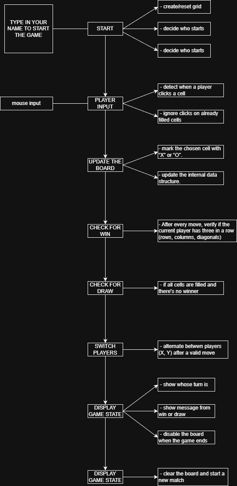

## ASSIGNMENT 2 - create a game
## BRIEF

Choose a “mini-game” to rebuild with HTML, CSS and JavaScript. The requirements are:

- The webpage should be responsive
- Choose an avatar at the beginning of the game
- Keep track of the score of the player
- Use the keyboard to control the game (indicate what are the controls in the page). You can also use buttons (mouse), but also keyboard.
- Use some multimedia files (audio, video, …)
- Implement an “automatic restart” in the game (that is not done via the refresh of the page)

# TIC TAC TOE

## DESCRIPTION OF THE GAME AND OF THE CODE BEHIND IT
This is an interactive Tic Tac Toe game that allows two players to compete against each other on a 3x3 grid, taking turns placing X's and O's until one player wins by getting three in a row (horizontally, vertically, or diagonally) or the game ends in a draw.
Each player must costumise their names in order to start the game.
The score is tracked across multiple rounds and some sound effects are included at some user interactions (clicks, errors, wins, draws).
The media queries are included, so the design adapts to desktop and mobile screens. The mobile screen includes a menu button.
The games also includes some visual feedback for the game states(turn, win, draw, error).

## STEP BY STEP
#### FLOW-CHART

##### User Actions Flow:
- Setup Phase: Enter names → Start game
- Gameplay Phase: Click cell → Check validity → Update board → Check result
- End Phase: Display result → Update score → Option to restart
- Reset Option: Available at any time to start new match or reset all scores

## LIST OF FUNCTIONS
In this section I'll be displaying:
- General role of the Javascript
- Name of the function
- What parameters does it expect (if any)
- Expression logic: describe what it does
- Return values: what values it return (if any)

#### General role in the project
The JavaScript file handles all the game logic, user interactions, and dynamic updates to the page.

##### Game State Management: 
Tracks the current board state, active player, and game status

##### Player Management: 
Stores and displays custom player names

##### Event Handling: 
Responds to user clicks on cells, buttons, and menu interactions

##### Game Logic: 
Determines winners, draws, and valid moves

##### DOM Manipulation: 
Updates the visual interface based on game state

##### Audio Control: 
Plays appropriate sound effects for different actions

##### Score Tracking: 
Maintains and updates scores across multiple rounds

##### Responsive Behavior: 
Manages different UI elements for desktop and mobile views

