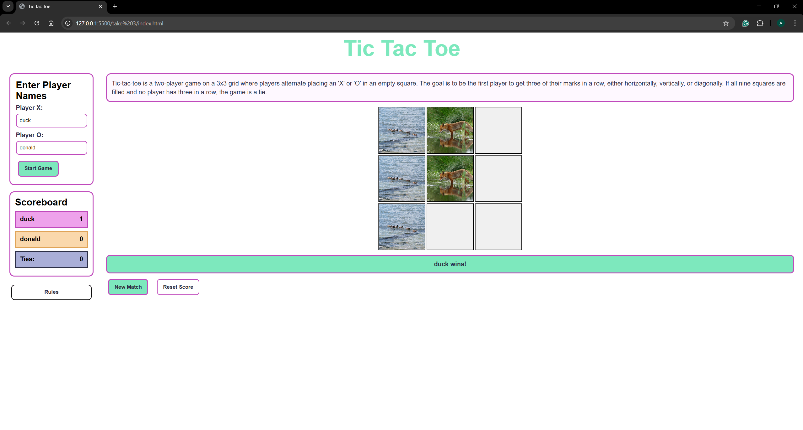
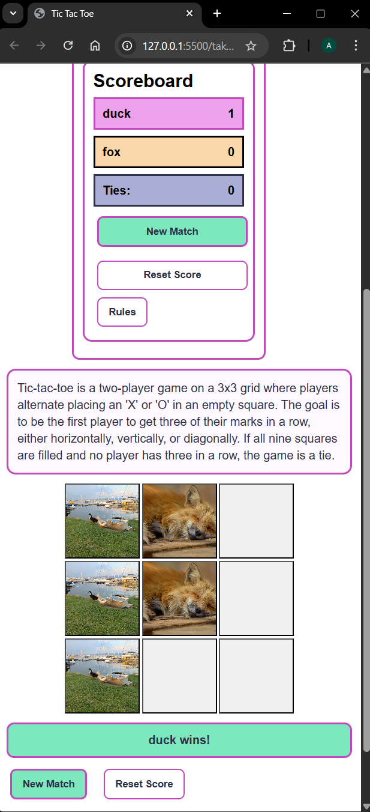
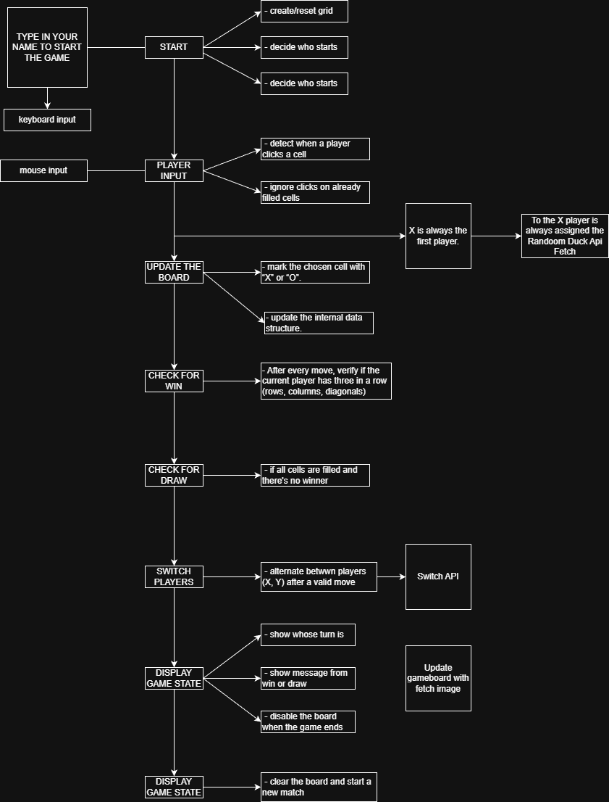

# Brief

Upgrade the **Assignment 02** by adding the use of data coming from an external web API. For example, fetch contents (audio, images, video, text, metadata) from online archives, AI generated contents (chatGPT API), data (weather, realtime traffic data, environmental data).

### The application **must** have those requirements:

- [x] The webpage is responsive
- [x] Use a web API (you choose which one best fists for your project) to load the data and display them in the webpage
- [x] At least one multimedia file (for user feedback interactions, or content itself)
- [x] Develop a navigation system that allows the user to navigate different sections with related content and functionalities

## Screenshots:
   

## Project description:
This project is an interactive tic-tac-toe game featuring dynamic animal avatars, custom sounds, score tracking, and responsive design. The logic manages turns, win conditions, and resets, while users interact through buttons, animations, API-generated images, and a toggleable rules panel.

## Diagram:

## Functions:
As I decided not to alter the structure of the code, the functions are the same as the previous assignment.
I will describe the functions that i changed for this new submission and the constants I added.

- #### API
- function fetchMatchImages():
Fetch/loads random images each match (preloading didn't work), for both X and O player

- #### SOUND EFFECTS
Added DUCK and FOX sounds (Foxes actually say something)

- #### function initGame()
I added the snippets to fetch the images from API when needed

- #### HANDLE CELL CLICK
Links cell click (user input) with sound, image and game state.

## Content and data sources:
The content of this assignment was mostly created by myself, but I did use some AI, specificaly Claude and ChatGPT. 
During this exercise I decided to deactivate Copilot suggestions, as I find them very confusing and they prevent me to actually face the challenge and think about it.
I was able to find some Tic-Tac-Toe tutorials, mainly for the html and css part. I used them as a sort of structure guideline, but I rework them so that my game fits my """personal style""" (css is so hard, though).
I also used the list of public APIs provided by the course.

## API documentation:
The APIs used for this exercise do not require a key to use them.
My js works with both of them at the same time. 
Ideally, I'd like to preload each image, so the user experiences a more dinamic game, but I wasn't able to achieve this, as the code kept on breaking.

- #### Duck API
https://random-d.uk/api

- #### Fox API
https://randomfox.ca/floof/

